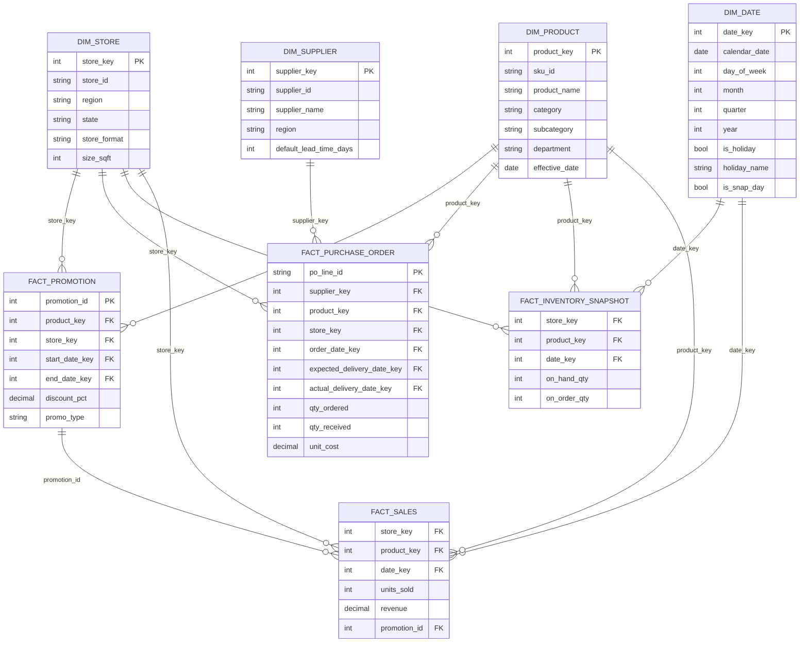

# Data Model (Phase 1)

Status: Draft for review. This defines the `mart` schema only — `raw` and `staging` are loosely-typed landing/cleaning layers that feed this model and don't need a formal schema yet.

## ERD

*(Metric/output tables — `metric_inventory_health`, `metric_demand_forecast`, `flag_anomaly` — are derived from this model in the Analytics/ML phases and are documented there, not here, since they're computed outputs rather than modeled source entities.)*

## Grain

| Table | Grain | Why |
|---|---|---|
| `fact_sales` | one row per store + product + day | Matches how retail sales are actually reported/aggregated; daily is enough resolution for inventory-health and forecasting use cases — no need for transaction-line grain |
| `fact_inventory_snapshot` | one row per store + product + day | A daily on-hand/on-order snapshot is what "days of supply" and stockout-risk calculations need; intra-day inventory movement isn't relevant to this problem |
| `fact_purchase_order` | one row per PO line | Cost and quantity genuinely vary per line within a PO; collapsing to PO-header grain would lose that and force awkward aggregation later |
| `fact_promotion` | one row per promotion instance (product + store + date range) | A promotion is a planned event with a start/end, not a per-day fact — joining it to `fact_sales` via `promotion_id` avoids duplicating promo attributes onto every sales row |

## Keys

- Surrogate integer keys (`*_key`) on every dimension and as FKs on facts — standard warehouse practice, insulates the model from source-system ID changes (one of our deliberately-injected data-quality problems), and is cheaper to join on than string natural keys.
- Natural/business keys (`sku_id`, `store_id`, `supplier_id`) are kept as separate columns on their dimensions, never discarded — needed for traceability back to source (NFR1) and for re-running loads idempotently.

## Slowly Changing Dimensions

- `dim_store` and `dim_supplier`: **SCD Type 1** (overwrite on change). Their attributes (region, lead time) changing mid-history isn't a scenario we need to analyze for this project — simplicity wins.
- `dim_product`: **SCD Type 1 for V1**, with an `effective_date` column kept as a placeholder. Product price/cost *do* realistically change over time and a full SCD Type 2 (versioned rows with valid-from/valid-to) would be the textbook-correct answer — but it's not needed to prove the core workflow (stockout/overstock risk, forecasting) and would add modeling and query complexity before we've validated anything else. Noting this explicitly so it's a deliberate simplification, not an oversight — revisit only if a later analysis (e.g., margin impact of price changes) actually needs it.

## What's deliberately *not* modeled yet

- A conformed "risk/recommendation" fact — this is Phase 3 analytics output, built on top of this model, not part of the source data model.
- Customer-level data — there is no customer entity in this problem; it's store/SKU inventory decisioning, not CRM.
